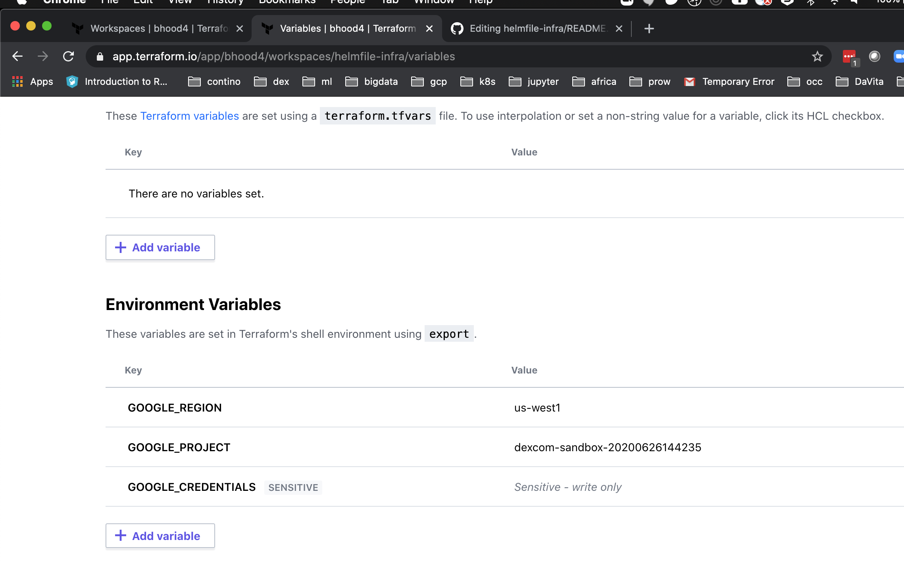

# Terraform cloud on GCP

* Create project/serviceaccount
* Create Terraform Cloud account at https://app.terraform.io/
* Deploy TF project to create private GKE in project
* Deploy TF project to setup GKE project (cluster admin, namespaces)
* Run helmfile
* post helmfile steps

# Create project/serviceaccount

For Sandbox project, use GCP cloud shell:

```bash
curl https://us-central1-it-devops.cloudfunctions.net/dexcom-sandbox-create -H "Author
ization: bearer $(gcloud auth print-identity-token)"

dexcom-sandbox-20200626144235

gcloud init
gcloud services enable iam.googleapis.com
gcloud services enable compute.googleapis.com
gcloud services enable container.googleapis.com
gcloud services enable serviceusage.googleapis.com
gcloud services enable cloudresourcemanager.googleapis.com

export USER=20200626144235
export TF_ADMIN=${USER}-terraform-admin
export TF_CREDS=~/.config/gcloud/${USER}-terraform-admin.json
gcloud iam service-accounts create terraform --display-name "Terraform admin account"
gcloud iam service-accounts keys create ${TF_CREDS} --iam-account terraform@${TF_ADMIN}.iam.gserviceaccount.com
```

* Add sandbox project owner role to terraform sa

* Create/download credentials for the project https://console.cloud.google.com/apis/credentials?project=dexcom-sandbox-20200626144235&organizationId=78200021690

# Deploy TF project to create private GKE in project
* https://app.terraform.io/
* create workspace
* pick github project (e.g. contino/helmfile-infra
* set directory=k8s_setup/gcp
* ENV variables
** GOOGLE_REGION=us-west1
** GOOGLE_PROJECT=dexcom-sandbox-20200626144235
** GOOGLE_CREDENTIALS= <<FILL IN SA CREDENTIALS DOWNLOAD ABOVE WITH NO CR>>
* plan and apply
 
 


# Deploy TF project to setup GKE project (cluster admin, namespaces)
* https://app.terraform.io/
* create workspace
* pick github project (e.g. contino/helmfile-infra
* ENV variables
** GOOGLE_REGION=us-west1
** GOOGLE_PROJECT=dexcom-sandbox-20200626144235
** GOOGLE_CREDENTIALS= <<FILL IN SA CREDENTIALS DOWNLOAD ABOVE WITH NO CR>>
* plan and apply
 
# Run helmfile
On client with normal helmfile setup:
```bash
gcloud container clusters get-credentials gcp --region us-west1 --project dexcom-sandbox-20200626144235
helmfile -e gcp apply
```

# Post helmfile
* Manually register the nginx-ingress public IP with DNS
* e.g. hover.com,  *.gcp = 35.197.30.191 
